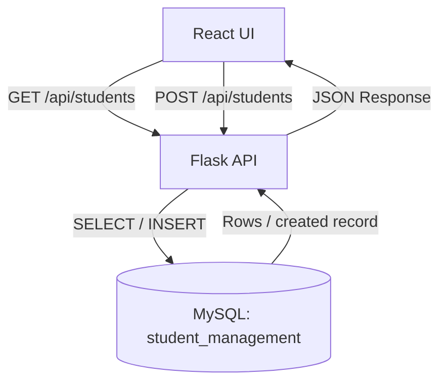

# Day 44 — Database Integration End-to-End

## Goal
Replace temporary in-memory student records with persistent MySQL storage while keeping the existing React + Flask application and API endpoints.

## Architecture

## GET flow
React `fetch()` → `GET /api/students` → Flask → MySQL `SELECT` → JSON → React state → Student List.

## POST flow
React form → `fetch()` POST → Flask validation → MySQL `INSERT` → JSON response → React success message → student list update.

## Error flow
Database/validation error → Flask catches the error → JSON `{ success: false, message: ... }` → React displays a user-friendly message.

## Persistence check
1. Add a student from the React form.
2. Confirm the success response.
3. Run `SELECT * FROM students;` in MySQL.
4. Confirm the new row exists.
5. Refresh React.
6. Confirm the same row is loaded from MySQL again.
