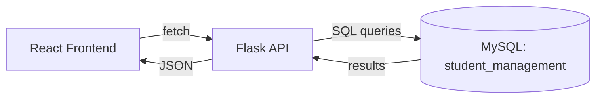

# Student Management System

Full-stack student management app: React frontend, Flask API, MySQL database.

## Project Overview

Students can be listed and added through a React UI. The React app talks to a
Flask REST API, which reads and writes a MySQL `students` table. Data persists
across page refreshes and server restarts.

## Technology Stack

- Frontend: React (Vite)
- Backend: Flask, flask-cors
- Database: MySQL (`mysql-connector-python`)
- Config: `python-dotenv`, environment variables

## Architecture



## Database Structure

Database: `student_management`

**students**

| Column | Type         | Notes            |
|--------|--------------|------------------|
| id     | INT          | primary key, auto-increment |
| name   | VARCHAR(100) | not null         |
| email  | VARCHAR(150) | not null, unique |
| course | VARCHAR(100) | not null         |

## MySQL Database Setup

```bash
mysql -u root -p < backend/schema.sql
```

This creates the `student_management` database, the `students` table, and
inserts 5 sample records.

## API Endpoints

### `GET /api/students`
Returns all students from MySQL.
```json
{ "success": true, "data": [ { "id": 1, "name": "...", "email": "...", "course": "..." } ] }
```

### `POST /api/students`
Inserts a new student. Body:
```json
{ "name": "Jane Doe", "email": "jane@example.com", "course": "B.Tech CSE" }
```
Success (201):
```json
{ "success": true, "message": "Student added successfully", "data": { "id": 6, "...": "..." } }
```
Failure (400/409/500):
```json
{ "success": false, "message": "Unable to save student" }
```

## Environment Configuration

Copy `backend/.env.example` to `backend/.env` and fill in your local MySQL
credentials:

```
DB_HOST=localhost
DB_USER=root
DB_PASSWORD=your_mysql_password
DB_NAME=student_management
```

`.env` is listed in `.gitignore` and is never committed.

## How to Run the Project

**Backend**
```bash
cd backend
python -m venv venv && source venv/bin/activate   # Windows: venv\Scripts\activate
pip install -r requirements.txt
cp .env.example .env   # then edit with your MySQL password
python app.py
```
Runs on `http://localhost:5000`.

**Frontend**
```bash
cd frontend
npm install
npm run dev
```
Runs on `http://localhost:5173` (default Vite port).

## Error Handling

The Flask backend returns a JSON error object (`{ "success": false, "message": "..." }`)
instead of crashing on:
- database connection failure
- missing required fields (400)
- duplicate email (409, MySQL error 1062 on the unique constraint)
- any other database operation failure (500)

The React frontend catches these and displays the `message` to the user
instead of failing silently.

## Data Persistence

Records are stored in MySQL, not in a Python list — adding a student via the
form, then refreshing the page, reloads the student from the database rather
than from memory.
