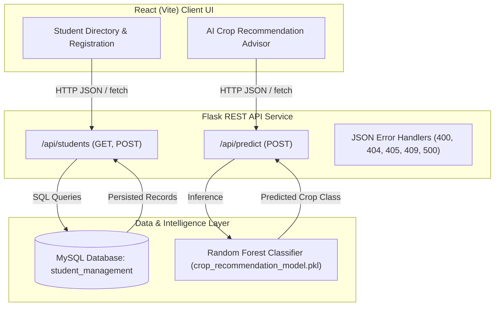

# Nexus Suite — Student Management & ML Crop Intelligence Platform

An enterprise full-stack platform combining relational student records management with an AI-driven agricultural crop recommendation machine learning engine. Built with a React (Vite) frontend, Flask REST API, MySQL database, and scikit-learn predictive inference model.

---

## 🏛️ System Architecture



---

## 🚀 Technology Stack

- **Frontend:** React 18, Vite, Modern Vanilla CSS (Custom Design System, Google Plus Jakarta Sans)
- **Backend:** Python Flask, Flask-CORS, python-dotenv
- **Database:** MySQL Server, `mysql-connector-python`
- **Machine Learning:** scikit-learn (`RandomForestClassifier`), pandas
- **API Testing:** Postman Test Collection (`Student_Management_API.postman_collection.json`)

---

## 🗄️ Database Structure

**Database:** `student_management`  
**Table:** `students`

| Column | Type | Attributes | Description |
| :--- | :--- | :--- | :--- |
| `id` | `INT` | Primary Key, Auto Increment | Unique Student Identifier |
| `name` | `VARCHAR(100)` | NOT NULL | Student Full Name |
| `email` | `VARCHAR(150)` | NOT NULL, UNIQUE | Primary Contact Email |
| `course` | `VARCHAR(100)` | NOT NULL | Enrolled Academic Degree |

### Database Initialization
```bash
mysql -u root -p < backend/schema.sql
```

---

## 📡 REST API Endpoints

### 1. `GET /api/students`
Retrieves all registered students from MySQL.
* **Response (200 OK):**
```json
{
  "success": true,
  "data": [
    { "id": 1, "name": "Ananya Rao", "email": "ananya.rao@example.com", "course": "B.Tech AI & DS" },
    { "id": 2, "name": "Karthik Iyer", "email": "karthik.iyer@example.com", "course": "B.Tech CSE" }
  ]
}
```

### 2. `POST /api/students`
Registers a new student into the database with duplicate email checks and field validation.
* **Payload:**
```json
{
  "name": "Jane Doe",
  "email": "jane@example.com",
  "course": "B.Tech CSE"
}
```
* **Success (201 Created):**
```json
{
  "success": true,
  "message": "Student added successfully",
  "data": { "id": 6, "name": "Jane Doe", "email": "jane@example.com", "course": "B.Tech CSE" }
}
```
* **Conflict (409 Conflict):**
```json
{
  "success": false,
  "message": "A student with this email already exists"
}
```

### 3. `POST /api/predict`
Executes real-time machine learning inference using 7 soil and climate parameters.
* **Payload:**
```json
{
  "N": 90,
  "P": 42,
  "K": 43,
  "temperature": 20.87,
  "humidity": 82.0,
  "ph": 6.5,
  "rainfall": 202.9
}
```
* **Success (200 OK):**
```json
{
  "success": true,
  "prediction": "rice"
}
```
* **Validation Error (400 Bad Request):**
```json
{
  "success": false,
  "error": "Missing required input: K"
}
```

---

## ⚙️ Environment Configuration

Create a `.env` file in the `backend/` directory with your local credentials:
```env
DB_HOST=localhost
DB_USER=root
DB_PASSWORD=your_mysql_password
DB_NAME=student_management
```
*(Note: `.env` is ignored in `.gitignore` to prevent credential exposure)*

---

## 🏃 Running the Application

### 1. Start Backend API Server
```powershell
cd backend
python -m venv venv
venv\Scripts\activate
pip install -r requirements.txt
python app.py
```
Backend runs on `http://localhost:5000`.

### 2. Start Frontend UI
```powershell
cd frontend
npm install
npm run dev
```
Frontend runs on `http://localhost:5173`.

---

## 🛡️ Error Handling & Reliability

- **Graceful JSON Responses:** Custom error handlers for `400`, `404`, `405`, `409`, and `500` guarantee clean JSON output instead of Flask's default HTML error pages.
- **Model Isolation:** ML model is loaded once at server startup in memory (`backend/ml/model.py`) to eliminate per-request file I/O latency.
- **Input Validation:** Strict field presence, type checking, and boundary constraints (`0 <= ph <= 14`, `0 <= humidity <= 100`) protect inference stability.
